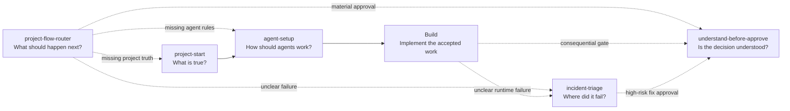

# Jinni Skills

[](https://github.com/DanielJD1216/Jinni-Skills.md/actions/workflows/validate.yml)
[](LICENSE)
[](skills/)

Practical workflow guardrails for coding agents. Install them in two minutes, then call one by name or let the router choose the smallest useful workflow.

These are not prompt collections. Each skill is an installable package with trigger rules, explicit boundaries, examples, evaluations, and focused verification.

## Two-Minute Start

### 1. Download

```bash
git clone https://github.com/DanielJD1216/Jinni-Skills.md.git
cd Jinni-Skills.md
```

### 2. Install

Codex:

```bash
python3 scripts/install_skills.py --target codex --all
```

Claude Code:

```bash
python3 scripts/install_skills.py --target claude --all
```

Another Agent Skills compatible tool:

```bash
python3 scripts/install_skills.py --dest /path/to/your/skills --all
```

The installer never silently overwrites an existing skill. Use `--dry-run` to preview, or `--force` to replace while keeping a timestamped backup.

### 3. Run Your First Workflow

Open a project and say:

```text
Use project-flow-router. Inspect this repository and run only the workflow worth running now.
```

Example result:

```text
Router: participated
Owner: project-start -> agent-setup
Reason: Current project truth is required before reliable agent instructions.
Boundary: route-only
Next gate: Establish current project truth, then create repository instructions.
```

The router may select a skill, return a short prerequisite order, continue a recorded gate, or stop for one missing decision. It does not run every workflow by default.

If the new skills do not appear, restart the coding assistant once so it refreshes its catalog.

[Read the detailed getting-started guide](docs/getting-started.md) or [see five realistic examples](docs/examples.md).

## Pick A Skill

| You are trying to... | Use | What you get |
|---|---|---|
| decide what this project needs next | [`project-flow-router`](skills/project-flow-router/) | one owner, a short prerequisite sequence, or one focused stop |
| understand a new, inherited, or messy repository | [`project-start`](skills/project-start/) | durable project context and a first-debug runbook |
| teach coding agents how to work in a repository | [`agent-setup`](skills/agent-setup/) | evidence-backed `AGENTS.md`, `CLAUDE.md`, or another entrypoint |
| localize a messy production or staging failure | [`incident-triage`](skills/incident-triage/) | failed-layer evidence, safe checks, and the next diagnostic action |
| approve a consequential change responsibly | [`understand-before-approve`](skills/understand-before-approve/) | explanation, comprehension check, grading, and readiness verdict |

Direct invocation is faster when the owner is obvious:

```text
Use incident-triage on this webhook outage. Stay read-only until the failed layer is proven.
```

Use the router only when ownership, prerequisites, recovery state, or the next gate is genuinely unclear.

## How The Collection Fits Together



This is not a mandatory lifecycle. Most requests should use one skill or no skill at all.

## What Makes A Skill Release-Ready

Every published skill must have:

- a clear positive and negative trigger boundary;
- plain-English documentation and realistic examples;
- fictional or sanitized evaluation data;
- no local paths, client identifiers, credentials, or copied private logs;
- focused tests for bundled scripts;
- a clean installable directory whose name matches its frontmatter;
- human release acceptance kept separate from technical validation.

The repository runs the same checks in GitHub Actions:

```bash
python3 scripts/validate_repository.py
```

Current automated coverage includes installer tests, skill script tests, profile validation, JSON parsing, relative-link checks, privacy checks, and generated-file checks.

## Installation Options

List available skills:

```bash
python3 scripts/install_skills.py --list
```

Install only the two most useful starting skills:

```bash
python3 scripts/install_skills.py --target codex project-flow-router project-start
```

Preview an installation:

```bash
python3 scripts/install_skills.py --target codex --all --dry-run
```

Safely update installed copies:

```bash
git pull
python3 scripts/install_skills.py --target codex --all --force
```

`--force` keeps the prior copy beside the replacement as `skill-name.backup-<timestamp>`.

## Project Status

Five independently usable skills are published. There is no promised unfinished bundle required for them to work. Future skills are published only after they pass the [release checklist](docs/release-checklist.md).

This is currently a single-maintainer project. That is a real maturity constraint, not something documentation can hide. Reproducible tests, conservative installation, a public changelog, and contribution guidance reduce the operational risk while the contributor base grows.

## Contributing And Support

- [Contributing](CONTRIBUTING.md)
- [Support and compatibility](SUPPORT.md)
- [Security policy](SECURITY.md)
- [Changelog](CHANGELOG.md)
- [Release checklist](docs/release-checklist.md)

## Repository Structure

```text
skills/             Installable skill packages
scripts/            Safe installer and repository validation
scripts/tests/      Repository tooling tests
docs/               Onboarding, examples, and release policy
.github/workflows/  Continuous validation
```

Only sanitized distribution copies belong here. Personal installed skills, private profiles, project-specific examples, and private evaluation transcripts stay outside this repository.

## License

Original work in this repository is available under the [MIT License](LICENSE). Adapted or third-party material must retain its upstream license and attribution inside its skill directory.
