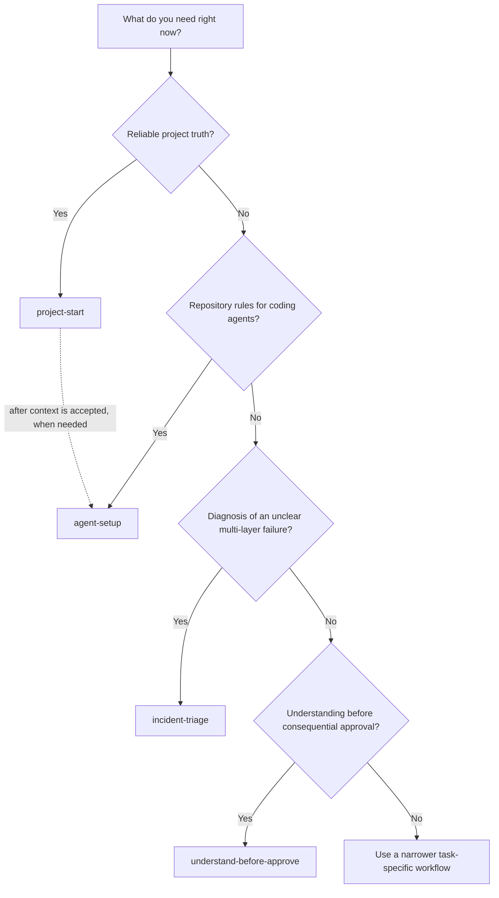
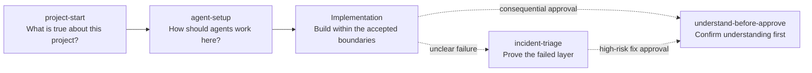

# Jinni Skills

A curated collection of reusable agent skills maintained by Jinni. Each skill gives a coding agent a focused workflow, clear boundaries, and a defined output.

## Status

This is an open-source collection of sanitized, validated agent skills released under the MIT License.

Only sanitized distribution copies belong here. Installed skills under personal agent directories are working sources, not public release sources.

Repository-level original work is licensed under MIT. Adapted or third-party material must retain its upstream license and attribution, and may declare different terms inside its own directory.

## Choose A Skill



## Published Skills

| Skill | Plain-English purpose | What it produces |
|---|---|---|
| [`understand-before-approve`](skills/understand-before-approve/) | Makes sure the decision-maker understands a consequential change before approving it | Evidence brief, comprehension check, grading, and approval verdict |
| [`project-start`](skills/project-start/) | Builds reliable project memory from the repository and accepted decisions | Six focused context files and a first-debug runbook |
| [`agent-setup`](skills/agent-setup/) | Tells coding agents how to work safely and correctly inside a repository | `AGENTS.md`, `CLAUDE.md`, or another supported agent entrypoint |
| [`incident-triage`](skills/incident-triage/) | Finds the failed layer in a messy incident before anyone guesses at a fix | Read-only diagnostic packet, evidence gaps, safe checks, and the next decision |

## How They Fit Together



These skills are not a mandatory sequence. Use only the skill that matches the current situation. `project-start` and `agent-setup` are the main pair: one records project truth, and the other turns that truth into operating rules for agents.

## Release Order

1. `understand-before-approve`
2. `incident-triage`
3. `project-start` and `agent-setup`
4. `loop-engineering`
5. `skill-forge`
6. A generalized `project-flow-router`

Entries 1 through 3 are published. The remaining entries are planned and must pass the same release checklist before publication.

## Repository Rules

- Keep one installable folder per skill under `skills/`.
- Make each folder name match the `name` field in its `SKILL.md`.
- Never add client names, personal data, credentials, private URLs, local absolute paths, copied logs, or production identifiers.
- Keep private profiles, project-specific examples, and internal evaluations outside this repository.
- Confirm authorship, upstream licenses, and required attribution before publishing.
- Validate an extracted release archive, not only the working directory.
- Treat approval to prepare a release as separate from approval to publish it.

## Structure

```text
skills/             Sanitized, installable skill folders
docs/               Release policy and portfolio documentation
README.md           Repository overview
```

Every skill must pass the release checklist before it is added to the public `main` branch.

## License

Original work in this repository is available under the [MIT License](LICENSE). Third-party or adapted material remains subject to any license and attribution included in its skill directory.
