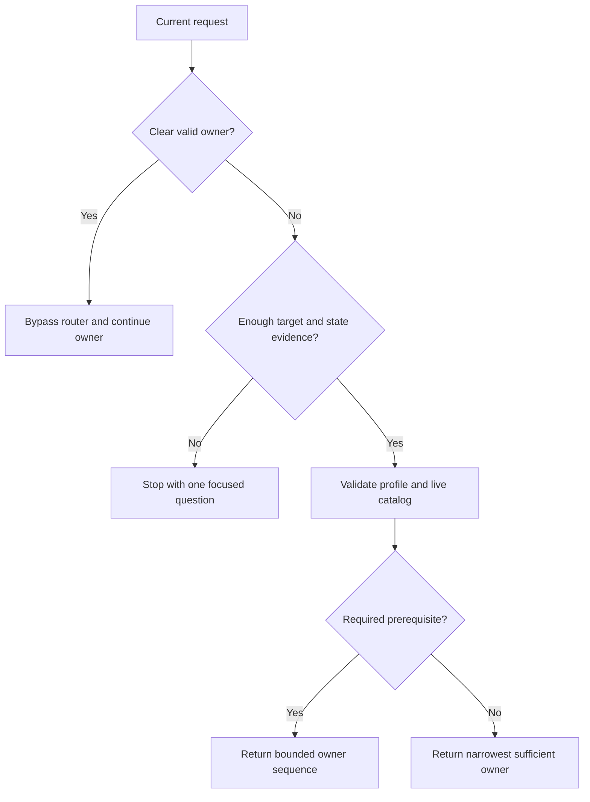

# Project Flow Router

## Plain English

Use this skill when you know work needs to happen but the correct workflow owner, prerequisite order, or next gate is unclear. It inspects only enough current state to make that decision, then routes to one owner or a short dependency sequence.

It is a traffic controller, not a project manager. It does not run every skill, rebuild project context without cause, or execute specialist work while pretending to route.

## When To Use It

- the repository is messy and the correct starting workflow is unclear;
- a recovery record exists but may be stale;
- two specialist skills appear to overlap;
- a requested task is missing a required prerequisite;
- an authenticated browser task does not identify which browser owns the session;
- the user asks the router to choose or continue the current route.

## When Not To Use It

- the user explicitly named a valid specialist and its target;
- the task is a direct factual question or narrow utility action;
- an accepted plan already records the next owner;
- the request is a bounded implementation, audit, review, or skill edit with a clear owner;
- the router itself is only being discussed, changed, tested, or packaged.

## What It Produces

A concise decision containing the selected owner, participation state, reason, evidence inspected, profile and catalog state, target, first boundary, and any next gate. It writes a route or recovery record only when that artifact is explicitly authorized.

## How It Works



## Starter Profile

`references/routing-profile.yaml` is a sanitized, Codex-oriented starter, not a universal catalog. Adapt its owners and conditions to the skills exposed by your coding assistant. The router treats the live host catalog as availability truth, so a profile entry does not prove that a skill is installed.

The contract includes Fabled container handling and the `understand-before-approve` mandatory gate. Fabled rules remain dormant unless the current run explicitly proves Fabled ownership. Removing either integration requires coordinated edits to `SKILL.md`, the profile, the validator, and its tests. Deleting only the YAML entries will fail validation by design.

Validate the profile after every change:

```bash
python3 scripts/validate_routing_profile.py --expected-version 1.10.0 references/routing-profile.yaml
python3 -m unittest discover -s tests -p 'test_*.py' -v
```

## Example

A user asks an agent to create implementation issues, but the repository has no accepted plan or PRD. The router does not start coding and does not invent issue scope. It returns the prerequisite sequence `to-prd -> to-issues`, with the accepted PRD as the first stop gate.

## Install

Place the `project-flow-router` directory in the skill directory used by your coding assistant.

- Codex: `~/.codex/skills/project-flow-router/`
- Claude Code: `~/.claude/skills/project-flow-router/`
- Other Agent Skills compatible tools: use the documented user or project skill directory.

Keep the directory name and the `name` field in `SKILL.md` as `project-flow-router`.

## Package Contents

- `SKILL.md`: participation rules, routing algorithm, stop gates, and output contract
- `references/routing-profile.yaml`: validated starter owner profile
- `references/`: evidence, recovery, truth, and worked-example guidance
- `assets/`: optional route and recovery record templates
- `scripts/validate_routing_profile.py`: dependency-free profile validator
- `tests/`: validator regression tests
- `evals/`: behavioral and trigger-boundary cases
- `agents/openai.yaml`: optional Codex discovery metadata

## License

Released under the MIT License. See `LICENSE`.
